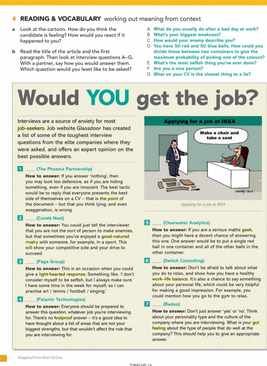

https://sites.google.com/view/eng-course-c-science-2025-2026/unit-1a-student-book?authuser=0

## Pag.8

### Would you get a job?

1. G
2. C
3. E
4. B
5. D
6. A
7. F

## Pag.9

### Esercizio E:

1. "Gut feeling"
2. "foolproof"
3. "Light-hearted response"
4. "geek"
5. "work-life balance"
6. "the point of"
7. "good-natured rivarly"
8. "job-seekers"

### Esercizio 5.b:

1. if you could have dinner with three people from the past, who would you choose and why?

- john lenon, picasso, (didn't remember)

2. Do you have a boyfriend and are you planning of getting pregnant?

- no, i don't have a boyfriend
- she didn't wanted to work there

3. Do you still pratice philosofy?

- i still think a lot
- he got a job

4. what animal would you like to be reincarnater as?

- cat
- he didn't get the job
